# Manual de Usuario - Enterprise Sales Predictor

Enterprise Sales Predictor es una plataforma web para cargar historicos de ventas, consultar informacion comercial, generar reportes, proyectar demanda y gestionar recomendaciones de abastecimiento con trazabilidad y control de acceso.

Este manual explica el uso de los modulos disponibles para usuarios finales. Las opciones visibles pueden variar segun los permisos asignados a cada perfil.

## Como Completar Las Imagenes

Guarda las capturas de pantalla en esta carpeta:

```text
docs/manual-usuario/images/
```

Usa exactamente los nombres indicados en cada seccion. Si una imagen no aparece en el manual, verifica que el archivo exista y que el nombre coincida, incluyendo extension `.png`.

## Imagenes Requeridas

| Archivo | Captura requerida |
|---------|-------------------|
| `01-login.png` | Pantalla completa de inicio de sesion antes de ingresar credenciales. |
| `02-menu-lateral.png` | Pantalla autenticada donde se vea claramente el menu lateral con los modulos disponibles. |
| `03-tablero-control.png` | Panel ejecutivo con KPIs, mejores clientes/productos, accesos rapidos y alertas. |
| `04-carga-archivos.png` | Modulo Cargas mostrando zona de carga, formatos permitidos y boton Procesar carga. |
| `05-historial-cargas.png` | Seccion Historial de cargas con registros y accion Ver errores. |
| `06-consulta-ventas.png` | Modulo Consulta de ventas con filtros, tabla de resultados y boton de exportacion. |
| `07-reportes.png` | Modulo Reportes con filtros, tarjetas de reportes y botones de exportacion. |
| `08-proyeccion-ventas.png` | Modulo Proyeccion de ventas con formulario Desde, Hasta, Producto y Cliente. |
| `09-resultados-proyeccion.png` | Resultados de proyeccion con resumen general y tablas por cliente/producto. |
| `10-abastecimiento.png` | Modulo Proyeccion de abastecimiento con filtros y resultado proyectado. |
| `11-aprobacion-abastecimiento.png` | Listado pendiente de aprobaciones con acciones Aprobar, Rechazar y Analisis. |
| `12-detalle-recomendacion.png` | Detalle de una recomendacion de abastecimiento y acciones de revision. |
| `13-gestion-accesos.png` | Gestion de accesos con usuarios, creacion de usuario, roles y permisos. |
| `14-auditoria.png` | Auditoria operativa con filtros y tablas de auditoria de cargas, exportaciones y funcional. |
| `15-cierre-sesion.png` | Encabezado superior con usuario conectado y boton Cerrar sesion. |

## Acceso Al Sistema

1. Abre la URL de la aplicacion web.
2. Ingresa tu usuario corporativo.
3. Ingresa tu clave.
4. Presiona `Ingresar al sistema`.

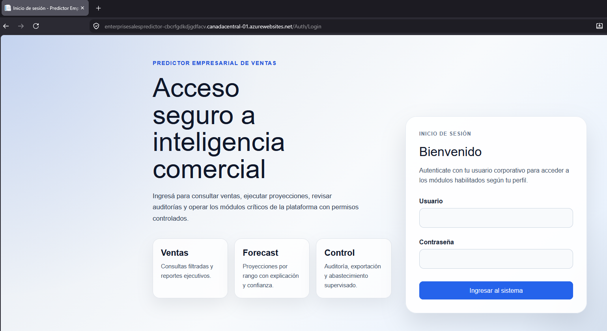

Si las credenciales son validas, el sistema abre el tablero principal. Si las credenciales son incorrectas o el usuario no tiene permisos, la aplicacion muestra un mensaje de acceso rechazado.

## Navegacion General

La aplicacion usa un menu lateral para acceder a los modulos. El menu solo muestra las opciones habilitadas para el usuario autenticado.

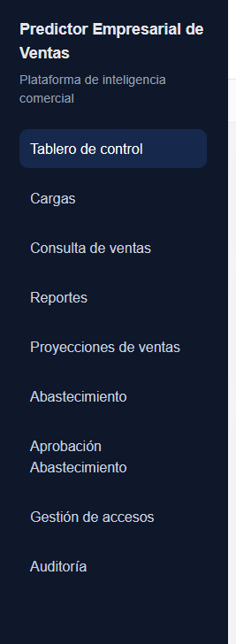

Elementos principales de la pantalla:

| Elemento | Descripcion |
|----------|-------------|
| Menu lateral | Permite cambiar entre modulos. |
| Encabezado | Muestra el titulo de la pagina actual y el usuario conectado. |
| Migas de pan | Indican la ubicacion actual dentro de la aplicacion. |
| Notificaciones | Informan operaciones exitosas o errores. |
| Contenido principal | Area donde se muestran formularios, tablas, reportes y resultados. |

## Tablero De Control

El tablero resume la informacion comercial principal. Permite revisar indicadores generales, entidades con mejor desempeno y alertas comerciales.

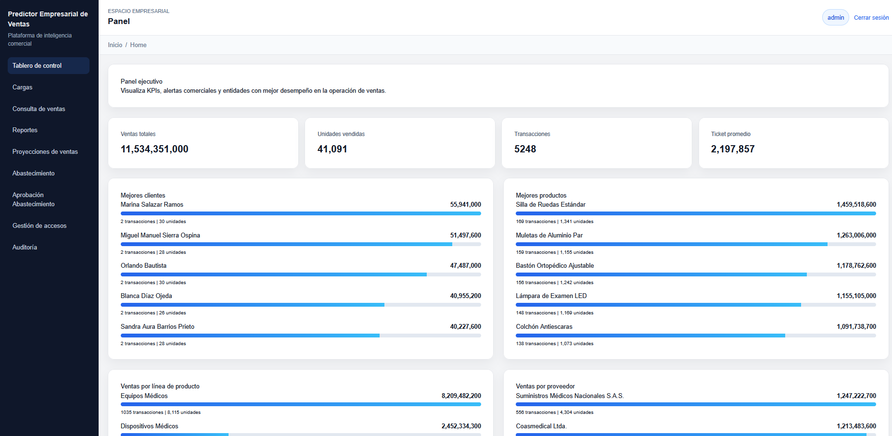

Informacion disponible:

| Seccion | Uso |
|---------|-----|
| Ventas totales | Muestra el monto total vendido. |
| Unidades vendidas | Muestra la cantidad total de unidades vendidas. |
| Transacciones | Indica el numero de operaciones registradas. |
| Ticket promedio | Resume el valor promedio por transaccion. |
| Mejores clientes | Lista clientes con mayor desempeno comercial. |
| Mejores productos | Lista productos con mayor desempeno. |
| Ventas por linea de producto | Agrupa ventas por linea. |
| Ventas por proveedor | Agrupa ventas por proveedor. |
| Accesos rapidos | Permite abrir cargas, ventas o auditoria desde el tablero. |
| Alertas comerciales | Muestra advertencias detectadas sobre los datos disponibles. |

## Carga De Archivos

El modulo `Cargas` permite incorporar historicos de ventas desde archivos Excel o archivos planos delimitados por punto y coma.

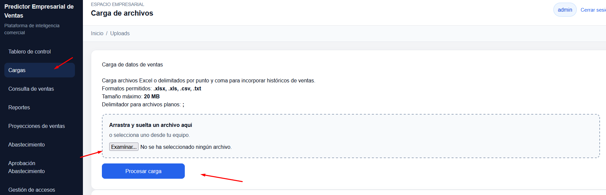

Pasos de uso:

1. Abre el modulo `Cargas`.
2. Arrastra el archivo sobre la zona de carga o seleccionalo desde tu equipo.
3. Verifica que el archivo cumpla el formato permitido.
4. Presiona `Procesar carga`.
5. Revisa el mensaje de confirmacion o error.
6. Consulta el historial para validar el estado final del procesamiento.

Reglas importantes:

| Regla | Descripcion |
|-------|-------------|
| Formatos permitidos | La pantalla informa las extensiones aceptadas por la aplicacion. |
| Tamano maximo | La pantalla indica el limite maximo del archivo. |
| Archivos planos | Deben usar `;` como delimitador. |
| Procesamiento | La carga puede procesarse en segundo plano. |

## Historial De Cargas

La seccion `Historial de cargas` permite revisar archivos procesados, estado de cada carga y cantidad de registros validos o invalidos.

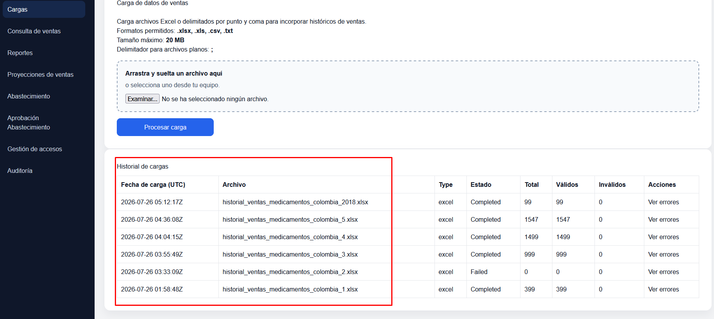

Columnas principales:

| Columna | Descripcion |
|---------|-------------|
| Fecha de carga | Fecha y hora en UTC en que se recibio el archivo. |
| Archivo | Nombre del archivo cargado. |
| Type | Tipo de archivo procesado. |
| Estado | Estado actual de la carga. |
| Total | Total de registros detectados. |
| Validos | Registros aceptados por la validacion. |
| Invalidos | Registros rechazados o con errores. |
| Acciones | Permite abrir el detalle de errores de la carga. |

## Consulta De Ventas

El modulo `Consulta de ventas` permite buscar ventas historicas usando filtros y paginacion. Tambien permite exportar los resultados filtrados si el usuario tiene permiso.

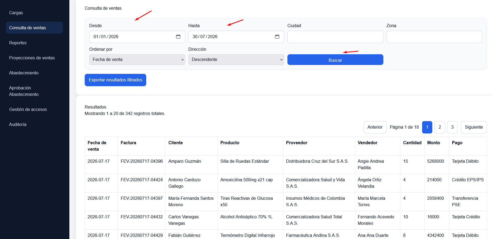

Pasos de uso:

1. Abre `Consulta de ventas`.
2. Completa el rango de fechas.
3. Opcionalmente filtra por ciudad o zona.
4. Selecciona el campo de ordenamiento.
5. Selecciona la direccion ascendente o descendente.
6. Presiona `Buscar`.
7. Revisa los resultados y navega con `Anterior` o `Siguiente` si hay varias paginas.

La tabla muestra:

| Columna | Descripcion |
|---------|-------------|
| Fecha de venta | Fecha de la operacion. |
| Factura | Numero de factura. |
| Cliente | Cliente asociado a la venta. |
| Producto | Producto vendido. |
| Proveedor | Proveedor del producto. |
| Vendedor | Usuario o vendedor asociado. |
| Cantidad | Unidades vendidas. |
| Monto | Valor de la venta. |
| Pago | Medio o condicion de pago. |

## Exportacion De Ventas

Desde `Consulta de ventas`, el boton `Exportar resultados filtrados` descarga la informacion segun los filtros actuales.

Antes de exportar, verifica que los filtros aplicados sean correctos. La aplicacion solicita confirmacion antes de generar el archivo.

## Reportes

El modulo `Reportes` centraliza reportes gerenciales, comerciales, operativos, de abastecimiento y predictivos.

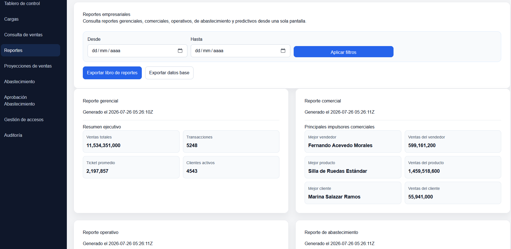

Acciones disponibles:

| Accion | Descripcion |
|--------|-------------|
| Aplicar filtros | Actualiza los reportes segun los criterios seleccionados. |
| Exportar libro de reportes | Descarga el conjunto de reportes actual. |
| Exportar datos base | Descarga el libro completo de datos base. |

Tipos de reportes:

| Tipo | Uso |
|------|-----|
| Gerencial | Indicadores para toma de decisiones ejecutivas. |
| Comercial | Informacion de ventas, clientes y productos. |
| Operativo | Datos para seguimiento de operacion. |
| Abastecimiento | Informacion relacionada con necesidades de compra. |
| Predictivo | Informacion basada en proyecciones. |

## Proyeccion De Ventas

El modulo `Proyecciones de ventas` permite generar estimaciones de ventas mensuales por cliente y producto.

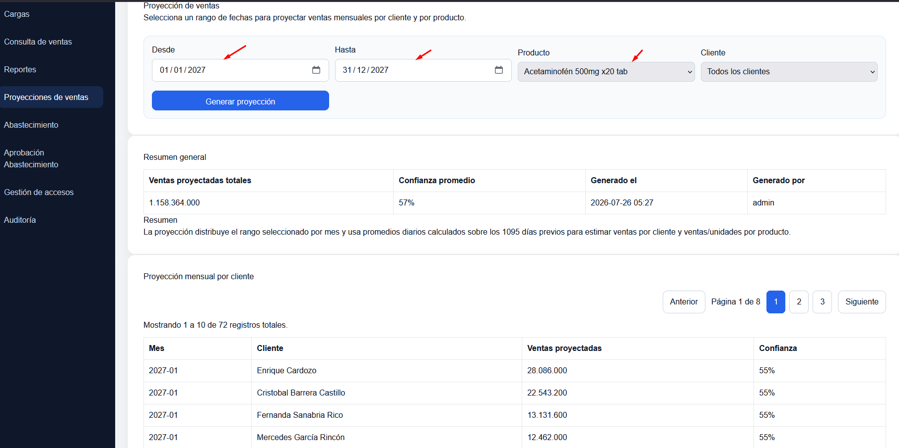

Pasos de uso:

1. Abre `Proyecciones de ventas`.
2. Selecciona la fecha `Desde`.
3. Selecciona la fecha `Hasta`.
4. Elige un producto.
5. Opcionalmente selecciona un cliente o deja `Todos los clientes`.
6. Presiona `Generar proyeccion`.
7. Espera a que el sistema muestre el resumen y las tablas de resultado.

## Resultados De Proyeccion

Luego de generar una proyeccion, el sistema muestra un resumen general y resultados mensuales por cliente y por producto.

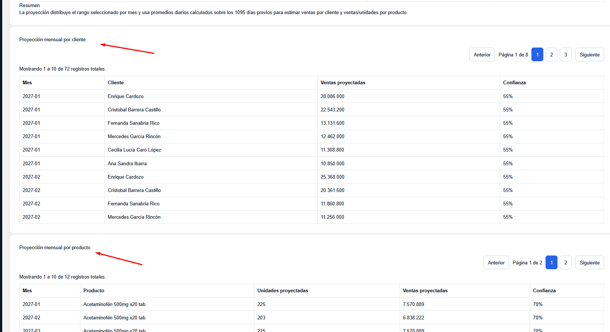

Secciones del resultado:

| Seccion | Descripcion |
|---------|-------------|
| Resumen general | Muestra ventas proyectadas, confianza, fecha de generacion y usuario. |
| Resumen | Presenta una explicacion textual de la proyeccion. |
| Proyeccion mensual por cliente | Lista ventas proyectadas por mes y cliente. |
| Proyeccion mensual por producto | Lista unidades y ventas proyectadas por mes y producto. |

## Proyeccion De Abastecimiento

El modulo `Abastecimiento` estima necesidades futuras de compra usando fechas, producto, cliente y stock actual.

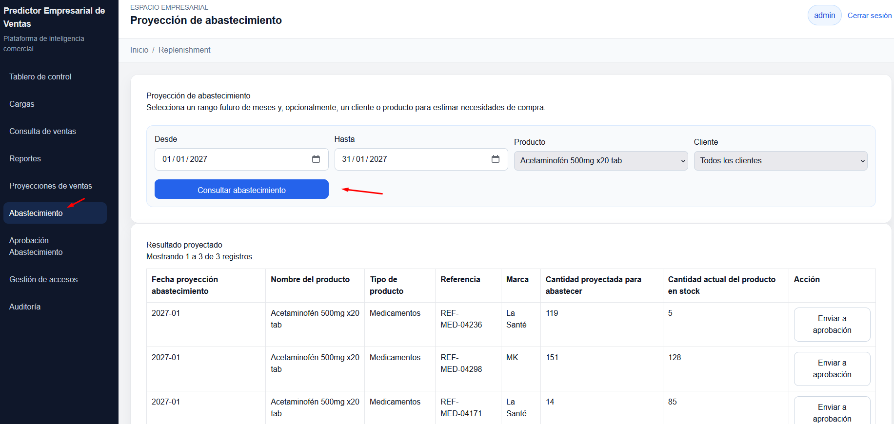

Pasos de uso:

1. Abre `Abastecimiento`.
2. Selecciona un rango futuro de fechas.
3. Elige un producto.
4. Opcionalmente selecciona un cliente.
5. Presiona `Consultar abastecimiento`.
6. Revisa las cantidades recomendadas y el stock actual.
7. Si corresponde, presiona `Enviar a aprobacion` sobre una recomendacion.

Columnas principales:

| Columna | Descripcion |
|---------|-------------|
| Fecha proyeccion abastecimiento | Mes proyectado para la necesidad de compra. |
| Nombre del producto | Producto recomendado. |
| Tipo de producto | Categoria o tipo del producto. |
| Referencia | Referencia interna del producto. |
| Marca | Marca del producto. |
| Cantidad proyectada para abastecer | Unidades recomendadas. |
| Cantidad actual del producto en stock | Stock actual disponible. |
| Accion | Permite enviar la recomendacion a aprobacion. |

## Aprobacion De Abastecimiento

El modulo `Aprobacion Abastecimiento` permite revisar sugerencias de compra enviadas a aprobacion.

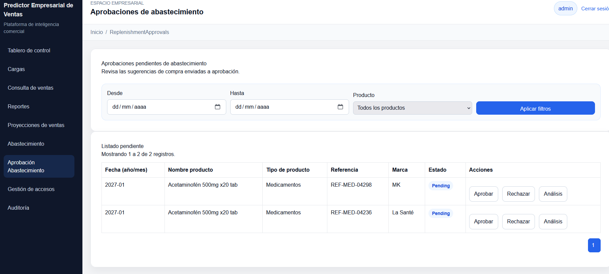

Pasos de uso:

1. Abre `Aprobacion Abastecimiento`.
2. Aplica filtros por fecha o producto si es necesario.
3. Revisa el listado pendiente.
4. Usa `Aprobar` para aceptar la sugerencia.
5. Usa `Rechazar` para descartar la sugerencia.
6. Usa `Analisis` para marcarla como pendiente de revision adicional.
7. Confirma la accion en el modal que muestra la aplicacion.

Estados y acciones:

| Accion | Resultado esperado |
|--------|--------------------|
| Aprobar | La recomendacion queda aprobada. |
| Rechazar | La recomendacion queda rechazada. |
| Analisis | La recomendacion queda marcada para analisis. |


## Gestion De Accesos

El modulo `Gestion de accesos` permite administrar usuarios, roles y permisos de la plataforma.

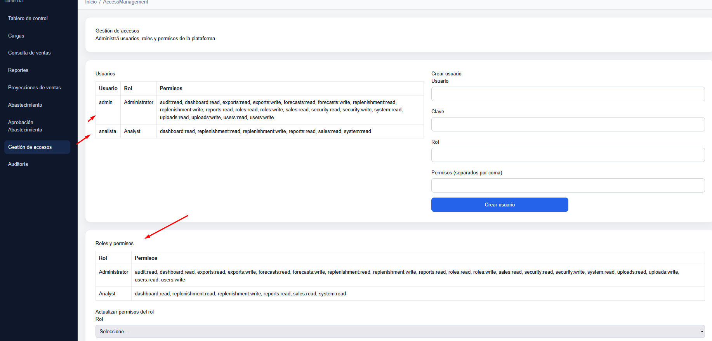

Funciones disponibles:

| Funcion | Descripcion |
|---------|-------------|
| Ver usuarios | Lista usuarios existentes, rol y permisos asignados. |
| Crear usuario | Registra un nuevo usuario con clave, rol y permisos. |
| Ver roles | Muestra roles existentes y sus permisos. |
| Actualizar rol | Cambia los permisos asociados a un rol. |
| Catalogo de permisos | Muestra permisos disponibles para asignacion. |

Pasos para crear un usuario:

1. Completa `Usuario`.
2. Completa `Clave`.
3. Ingresa o selecciona un `Rol`.
4. Escribe los permisos separados por coma si corresponde.
5. Presiona `Crear usuario`.

Pasos para actualizar permisos de un rol:

1. Selecciona el rol en `Actualizar permisos del rol`.
2. Escribe los permisos separados por coma.
3. Presiona `Actualizar rol`.
4. Verifica el mensaje de confirmacion.

## Auditoria Operativa

El modulo `Auditoria` permite revisar eventos registrados por el sistema, incluyendo cargas, exportaciones y operaciones funcionales.

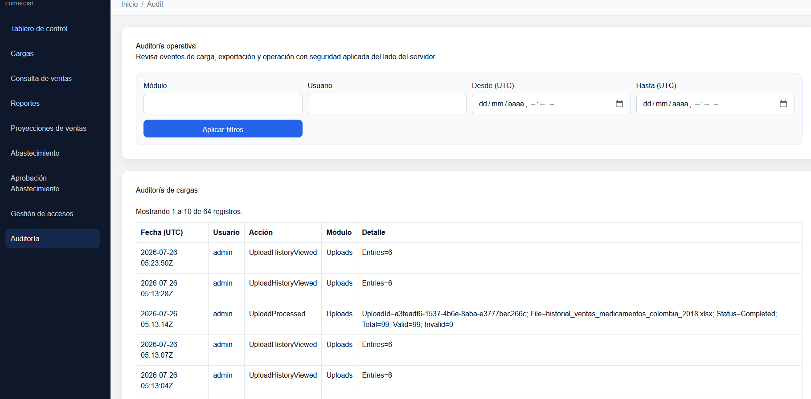

Pasos de uso:

1. Abre `Auditoria`.
2. Completa filtros si necesitas acotar la busqueda.
3. Presiona `Aplicar filtros`.
4. Revisa las secciones disponibles.
5. Usa la paginacion para navegar registros antiguos.

Secciones disponibles:

| Seccion | Descripcion |
|---------|-------------|
| Auditoria de cargas | Eventos relacionados con archivos cargados. |
| Auditoria de exportaciones | Eventos relacionados con descargas o exportaciones. |
| Auditoria funcional | Eventos de operacion registrados por los modulos. |

## Cierre De Sesion

Para salir de la aplicacion, usa el boton `Cerrar sesion` ubicado en el encabezado superior.

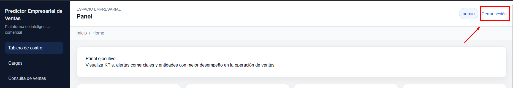

Recomendacion: cierra la sesion al terminar de trabajar, especialmente si usas un equipo compartido.

## Permisos Y Visibilidad De Modulos

La aplicacion muestra u oculta opciones segun los permisos del usuario. Si no ves un modulo, puede deberse a que tu rol no tiene permiso para accederlo.

| Modulo | Permiso asociado esperado |
|--------|---------------------------|
| Cargas | Lectura o gestion de cargas. |
| Consulta de ventas | Lectura de ventas. |
| Reportes | Lectura de reportes. |
| Proyecciones de ventas | Generacion de proyecciones. |
| Abastecimiento | Lectura o gestion de abastecimiento. |
| Gestion de accesos | Lectura o administracion de usuarios. |
| Auditoria | Lectura de auditoria. |

Si necesitas acceso adicional, solicita a un administrador que revise tu rol y permisos en `Gestion de accesos`.

## Buenas Practicas De Uso

| Practica | Motivo |
|----------|--------|
| Validar filtros antes de exportar | Evita descargar informacion incompleta o incorrecta. |
| Revisar errores de carga | Permite corregir datos antes de tomar decisiones. |
| Usar rangos de fecha concretos | Mejora la precision de consultas y proyecciones. |
| Confirmar recomendaciones antes de aprobar | Reduce errores en decisiones de compra. |
| Cerrar sesion al finalizar | Protege el acceso a informacion comercial. |

## Problemas Frecuentes

| Situacion | Que hacer |
|-----------|-----------|
| No puedo iniciar sesion | Verifica usuario y clave. Si persiste, solicita revision al administrador. |
| No veo un modulo | Tu usuario probablemente no tiene el permiso requerido. |
| Una carga aparece con errores | Abre `Ver errores`, corrige el archivo y vuelve a cargarlo. |
| Una consulta no devuelve datos | Revisa el rango de fechas y los filtros aplicados. |
| No puedo exportar | Puede faltar permiso de exportacion. Solicita revision del rol. |
| No hay recomendaciones de abastecimiento | Verifica fechas, producto, cliente y disponibilidad de datos historicos. |
